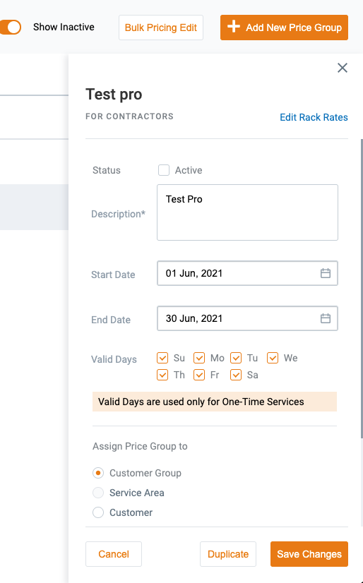

## Pricing Engine DB Tables structure

[Back to Pricing Engine](./Pricing Engine.md)

- `price_groups` table. It is a container for prices.

UI (to understand):



DB Structure:

```sql
CREATE TABLE price_groups(
  id INTEGER NOT NULL GENERATED BY DEFAULT AS IDENTITY,

  is_general BOOLEAN NOT NULL DEFAULT FALSE,
  description TEXT NOT NULL,

  business_unit_id INTEGER NOT NULL,
  business_line_id INTEGER NOT NULL,

  service_areas_ids INTEGER[] NOT NULL DEFAULT '{}',
  custom_group_id INTEGER DEFAULT NULL,
  customer_id INTEGER DEFAULT NULL,
  customer_job_site_id INTEGER DEFAULT NULL,

  active boolean NOT NULL DEFAULT true,
  valid_days INTEGER[] NOT NULL DEFAULT '{}',
  overweight_setting TEXT NOT NULL default 'global'::TEXT,
  usage_days_setting TEXT NOT NULL default 'global'::TEXT,
  demurrage_setting TEXT NOT NULL default 'global'::TEXT,
  dump_setting TEXT NOT NULL default 'material'::TEXT,
  load_setting TEXT NOT NULL default 'material'::TEXT,


  -- this is dates range for price group container,
  -- it activates/deactivates all linked prices,
  -- but we need to clarify what to do with
  -- entities linked to prices that are linked to price groups aren't active anymore
  start_at timestamp without time zone NOT NULL DEFAULT CURRENT_TIMESTAMP,
  end_at timestamp without time zone DEFAULT NULL,

  PRIMARY KEY ("id"),
  FOREIGN KEY ("business_unit_id") REFERENCES "business_units"("id") MATCH SIMPLE
      ON update NO ACTION
      ON delete RESTRICT,
  FOREIGN KEY ("business_line_id") REFERENCES "business_lines"("id") MATCH SIMPLE
      ON update NO ACTION
      ON delete RESTRICT,
  CHECK (overweight_setting = ANY (ARRAY['global'::TEXT, 'canSize'::TEXT, 'material'::TEXT, 'canSizeAndMaterial'::TEXT])),
  CHECK (usage_days_setting = ANY (ARRAY['global'::TEXT, 'canSize'::TEXT, 'material'::TEXT, 'canSizeAndMaterial'::TEXT])),
  CHECK (demurrage_setting = ANY (ARRAY['global'::TEXT, 'canSize'::TEXT, 'material'::TEXT, 'canSizeAndMaterial'::TEXT]))
);
CREATE INDEX "price_groups_start_at" ON "price_groups" ("start_at" DESC);
CREATE INDEX "price_groups_end_at" ON "price_groups" ("end_at" ASC NULLS LAST);
```

- `price_groups_historical` table. It is a log of states of Price Groups (new record with actual snapshot at each create/update operation).

DB Structure:

```sql
  -- this table will be used to show to which price group was linked an entity (through price)
  -- at the moment of creation/update
  -- and will show appropriate price group description and linked group entities for the moment
  -- of entity creation/update
CREATE TABLE price_groups_historical(
  id INTEGER NOT NULL GENERATED BY DEFAULT AS IDENTITY,

  is_general BOOLEAN DEFAULT FALSE,
  description TEXT DEFAULT NULL,

  business_unit_id INTEGER DEFAULT NULL,
  business_line_id INTEGER DEFAULT NULL,

  service_areas_ids INTEGER[] DEFAULT NULL,
  custom_group_id INTEGER DEFAULT NULL,
  customer_id INTEGER DEFAULT NULL,
  customer_job_site_id INTEGER DEFAULT NULL,

  active boolean DEFAULT NULL,
  valid_days INTEGER[] DEFAULT NULL,
  overweight_setting TEXT DEFAULT NULL,
  usage_days_setting TEXT DEFAULT NULL,
  demurrage_setting TEXT DEFAULT NULL,
  dump_setting TEXT NOT NULL DEFAULT NULL,
  load_setting TEXT NOT NULL DEFAULT NULL,

  start_at timestamp without time zone DEFAULT NULL,
  end_at timestamp without time zone DEFAULT NULL,

  original_id INTEGER NOT NULL,
  event_type TEXT NOT NULL,
  user_id TEXT NOT NULL,
  created_at timestamp without time zone DEFAULT CURRENT_TIMESTAMP,
  updated_at timestamp without time zone DEFAULT CURRENT_TIMESTAMP,
  trace_id TEXT NOT NULL,

  PRIMARY KEY ("id"),
  FOREIGN KEY ("original_id") REFERENCES "price_groups"("id") MATCH SIMPLE
      ON update NO ACTION
      ON delete RESTRICT,

  CHECK (event_type = ANY (ARRAY['created'::TEXT, 'edited'::TEXT, 'deleted'::TEXT]))
);
```

- `prices` table. It is a table that stores prices per each service/line item
  under price groups (Rack Rates).
  It's a schedule of rates for services/line items under price group.

UI (to understand):


DB Structure:

```sql
CREATE TABLE prices(
  id INTEGER NOT NULL GENERATED BY DEFAULT AS IDENTITY,

  price_group_id INTEGER NOT NULL,

  entity_type TEXT NOT NULL,

  billable_service_id INTEGER DEFAULT NULL,
  billable_line_item_id INTEGER DEFAULT NULL,
  equipment_item_id INTEGER DEFAULT NULL,
  material_id INTEGER DEFAULT NULL,
  threshold_id INTEGER DEFAULT NULL,
  surcharge_id INTEGER DEFAULT NULL,

  billing_cycle TEXT DEFAULT NULL,
  frequency_id INTEGER DEFAULT NULL,

  -- we never change the price: we create new record and
  -- set next_price and end_date for previous (closest by date) record
  price bigint NOT NULL, -- show as decimal depending on locale on FE, at least 6 fractional digits
  next_price bigint, -- show as decimal depending on locale on FE, at least 6 fractional digits
  limit numeric DEFAULT NULL, -- limit for threshold application

  -- we need this field cause we update ids on
  --    - linked one-time entities only for those who has service date starting from this date
  --    - linked recurring entities by cron on this date (but need to clarify
  start_at timestamp without time zone NOT NULL DEFAULT CURRENT_TIMESTAMP,
  end_at timestamp without time zone DEFAULT NULL,

  created_at timestamp without time zone DEFAULT CURRENT_TIMESTAMP,
  user_id TEXT NOT NULL,
  trace_id TEXT NOT NULL,

  PRIMARY KEY ("id"),
  FOREIGN KEY ("price_group_id") REFERENCES "price_groups"("id") MATCH SIMPLE
      ON update NO ACTION
      ON delete RESTRICT,

  CHECK (entity_type <@ (ARRAY['SURCHARGE'::TEXT, 'THRESHOLD'::TEXT, 'ONE_TIME_SERVICE'::TEXT, 'RECURRING_SERVICE'::TEXT, 'ONE_TIME_LINE_ITEM'::TEXT, 'RECURRING_LINE_ITEM'::TEXT])),
  CHECK(billing_cycle <@ (ARRAY['daily'::TEXT, 'weekly'::TEXT, 'monthly'::TEXT, '28days'::TEXT, 'quarterly'::TEXT, 'yearly'::TEXT]))
);
CREATE INDEX "prices_start_at" ON "prices" ("start_at" DESC);
CREATE INDEX "prices_end_at" ON "prices" ("end_at" ASC NULLS LAST);
```

- `subscription_service_items_schedule` table. Motivation:
  1. When CSR sets the new rate for the service via bulk update
     feature he sets an effective date.
     So he can set the new price starting from tomorrow and then again
     set the new price starting from next week and so on.
  2. When CSR updates the service item on Subscription Entry Form
     he sets an effective date for the change. For example at first edit CSR
     has changed quantity and set effective date for the next month.
     But then he can also change the frequency of servicing
     and set an effective date for this change in past (e.g. last Monday).
     This last change shouldn't change quantity for the service until next month
     as has been specified during quantity change.
  3. So usage of historical table is a dirty and hacky way
     and adds more complexity to understand the logic
     and structure because in general historical tables
     are only entity state snapshots.
     And when we add more logic on that -
     it results in misunderstanding between team members

DB Structure:

```sql
CREATE TABLE subscription_service_items_schedule(
  id INTEGER NOT NULL GENERATED BY DEFAULT AS IDENTITY,

  subscription_id INTEGER NOT NULL,
  subscription_service_item_id INTEGER NOT NULL,
  billable_service_id INTEGER NOT NULL,
  material_id INTEGER DEFAULT NULL,
  price_id INTEGER NOT NULL,

  billing_cycle TEXT NOT NULL,
  frequency_id INTEGER DEFAULT NULL,
  service_days_of_week JSONB DEFAULT NULL,

  quantity INTEGER DEFAULT NULL,
  override_price BOOLEAN DEFAULT FALSE,
  override_proration BOOLEAN DEFAULT FALSE,

  price bigint NOT NULL, -- show as decimal depending on locale on FE, at least 6 fractional digits
  overriden_price bigint NOT NULL, -- when override_price
  next_price bigint, -- show as decimal depending on locale on FE, at least 6 fractional digits
  amount bigint, -- show as decimal depending on locale on FE, at least 6 fractional digits
  prorated_amount bigint, -- show as decimal depending on locale on FE, at least 6 fractional digits
  overridden_prorated_amount bigint, -- when override_proration
  total bigint, -- show as decimal depending on locale on FE, at least 6 fractional digits

  -- transition between billing periods must split records
  -- so if this item has dates range limited by start_date and end_date
  -- that intersects with multiple billing periods
  -- then we have to split this item into multiple records
  -- and all of result records must be in range
  -- of appropriate billing period
  -- (or start_date/end_date if it restricts more)
  -- the same logic applies to invoicing - start_date and end_date of
  -- an invoice both can split this record onto multiple parts
  -- limited by own date range and invoice date range
  start_at timestamp without time zone NOT NULL DEFAULT CURRENT_TIMESTAMP,
  end_at timestamp without time zone DEFAULT NULL,

  invoiced_at timestamp without time zone DEFAULT NULL,
  paid_at timestamp without time zone DEFAULT NULL,

  created_at timestamp without time zone DEFAULT CURRENT_TIMESTAMP,

  PRIMARY KEY ("id"),
  FOREIGN KEY ("subscription_id") REFERENCES "subscriptions"("id") MATCH SIMPLE
      ON update NO ACTION
      ON delete RESTRICT,
  FOREIGN KEY ("subscription_service_item_id") REFERENCES "subscription_service_item"("id") MATCH SIMPLE
      ON update NO ACTION
      ON delete RESTRICT,
  FOREIGN KEY ("billable_service_id") REFERENCES "billable_services"("id") MATCH SIMPLE
      ON update NO ACTION
      ON delete RESTRICT,
  FOREIGN KEY ("material_id") REFERENCES "materials"("id") MATCH SIMPLE
      ON update NO ACTION
      ON delete RESTRICT,
  FOREIGN KEY ("price_id") REFERENCES "prices"("id") MATCH SIMPLE
      ON update NO ACTION
      ON delete RESTRICT,

  CHECK(billing_cycle <@ (ARRAY['daily'::TEXT, 'weekly'::TEXT, 'monthly'::TEXT, '28days'::TEXT, 'quarterly'::TEXT, 'yearly'::TEXT]))
);
CREATE INDEX "subscription_service_items_schedule_start_at" ON "subscription_service_items_schedule" ("start_at" DESC);
CREATE INDEX "subscription_service_items_schedule_end_at" ON "subscription_service_items_schedule" ("end_at" ASC NULLS LAST);
```

- `subscription_recurring_line_items_schedule` table. Motivation:
  the same as for `subscription_service_items_schedule` table

DB Structure:

```sql
CREATE TABLE subscription_recurring_line_items_schedule(
  id INTEGER NOT NULL GENERATED BY DEFAULT AS IDENTITY,

  subscription_id INTEGER NOT NULL,
  subscription_recurring_line_item_id INTEGER NOT NULL,
  billable_line_item_id INTEGER NOT NULL,
  price_id INTEGER NOT NULL,

  billing_cycle TEXT NOT NULL,

  quantity INTEGER DEFAULT NULL,
  override_price BOOLEAN DEFAULT FALSE,
  override_proration BOOLEAN DEFAULT FALSE, -- when override proration

  price bigint NOT NULL, -- show as decimal depending on locale on FE, at least 6 fractional digits
  overriden_price bigint NOT NULL, -- when override_price
  next_price bigint, -- show as decimal depending on locale on FE, at least 6 fractional digits
  amount bigint, -- show as decimal depending on locale on FE, at least 6 fractional digits
  prorated_amount bigint, -- show as decimal depending on locale on FE, at least 6 fractional digits
  overridden_prorated_amount bigint, -- when override_proration
  total bigint, -- show as decimal depending on locale on FE, at least 6 fractional digits

  -- transition between billing periods must split records
  -- so if this item has dates range limited by start_date and end_date
  -- that intersects with multiple billing periods
  -- then we have to split this item into multiple records
  -- and all of result records must be in range
  -- of appropriate billing period
  -- (or start_date/end_date if it restricts more)
  -- the same logic applies to invoicing - start_date and end_date of
  -- an invoice both can split this record onto multiple parts
  -- limited by own date range and invoice date range
  start_at timestamp without time zone NOT NULL DEFAULT CURRENT_TIMESTAMP,
  end_at timestamp without time zone DEFAULT NULL,

  invoiced_at timestamp without time zone DEFAULT NULL,
  paid_at timestamp without time zone DEFAULT NULL,

  created_at timestamp without time zone DEFAULT CURRENT_TIMESTAMP,

  PRIMARY KEY ("id"),
  FOREIGN KEY ("subscription_id") REFERENCES "subscriptions"("id") MATCH SIMPLE
      ON update NO ACTION
      ON delete RESTRICT,
  FOREIGN KEY ("subscription_recurring_line_item_id") REFERENCES "subscription_line_items"("id") MATCH SIMPLE
      ON update NO ACTION
      ON delete RESTRICT,
  FOREIGN KEY ("billable_line_item_id") REFERENCES "billable_line_items"("id") MATCH SIMPLE
      ON update NO ACTION
      ON delete RESTRICT,
  FOREIGN KEY ("price_id") REFERENCES "prices"("id") MATCH SIMPLE
      ON update NO ACTION
      ON delete RESTRICT,

  CHECK(billing_cycle <@ (ARRAY['daily'::TEXT, 'weekly'::TEXT, 'monthly'::TEXT, '28days'::TEXT, 'quarterly'::TEXT, 'yearly'::TEXT]))
);
CREATE INDEX "subscription_recurring_line_items_schedule_start_at" ON "subscription_recurring_line_items_schedule" ("start_at" DESC);
CREATE INDEX "subscription_recurring_line_items_schedule_end_at" ON "subscription_recurring_line_items_schedule" ("end_at" ASC NULLS LAST);
```

- `subscriptions_schedule` table. Motivation:
  `subscription_recurring_line_items_schedule`,
  `subscription_orders`,
  `subscription_orders_line_items`,
  `subscription_surcharge_items` tables and taxes

DB Structure:

```sql
CREATE TABLE subscriptions_schedule (
  id INTEGER NOT NULL GENERATED BY DEFAULT AS IDENTITY,

  subscription_id INTEGER NOT NULL,
  price_group_historical_id INTEGER NOT NULL,

  status TEXT NOT NULL,

  billing_cycle TEXT NOT NULL,
  billing_type TEXT NOT NULL,

  override_proration BOOLEAN DEFAULT FALSE,

  recurring_services_amount bigint, -- show as decimal depending on locale on FE, at least 6 fractional digits
  recurring_services_prorated_amount bigint, -- show as decimal depending on locale on FE, at least 6 fractional digits
  recurring_services_overridden_prorated_amount bigint, -- show as decimal depending on locale on FE, at least 6 fractional digits
  recurring_services_total bigint, -- show as decimal depending on locale on FE, at least 6 fractional digits

  recurring_line_items_amount bigint, -- show as decimal depending on locale on FE, at least 6 fractional digits
  recurring_line_items_overriden_amount bigint, -- show as decimal depending on locale on FE, at least 6 fractional digits
  recurring_line_items_total bigint, -- show as decimal depending on locale on FE, at least 6 fractional digits
  recurring_line_items_overriden_total bigint, -- show as decimal depending on locale on FE, at least 6 fractional digits

  recurring_amount bigint, -- show as decimal depending on locale on FE, at least 6 fractional digits
  recurring_overriden_amount bigint, -- show as decimal depending on locale on FE, at least 6 fractional digits
  recurring_total bigint, -- show as decimal depending on locale on FE, at least 6 fractional digits
  recurring_overriden_total bigint, -- show as decimal depending on locale on FE, at least 6 fractional digits

  -- includes total price for subscription orders
  -- that fall in this interval their line items
  one_time_amount bigint,
  one_time_overriden_amount bigint, -- show as decimal depending on locale on FE, at least 6 fractional digits
  one_time_total bigint,
  one_time_overriden_total bigint, -- show as decimal depending on locale on FE, at least 6 fractional digits

  before_taxes_grand_total bigint, -- show as decimal depending on locale on FE, at least 6 fractional digits
  before_taxes_overriden_grand_total bigint, -- show as decimal depending on locale on FE, at least 6 fractional digits
  grand_total bigint, -- show as decimal depending on locale on FE, at least 6 fractional digits
  overriden_grand_total bigint, -- show as decimal depending on locale on FE, at least 6 fractional digits

  next_grand_total bigint, -- show as decimal depending on locale on FE, at least 6 fractional digits

  -- transition between billing periods must split records
  -- so if this item has dates range limited by start_date and end_date
  -- that intersects with multiple billing periods
  -- then we have to split this item into multiple records
  -- and all of result records must be in range
  -- of appropriate billing period
  -- (or start_date/end_date if it restricts more)
  -- the same logic applies to invoicing - start_date and end_date of
  -- an invoice both can split this record onto multiple parts
  -- limited by own date range and invoice date range
  start_at timestamp without time zone NOT NULL DEFAULT CURRENT_TIMESTAMP,
  end_at timestamp without time zone DEFAULT NULL,

  invoiced_at timestamp without time zone DEFAULT NULL,
  paid_at timestamp without time zone DEFAULT NULL,

  created_at timestamp without time zone DEFAULT CURRENT_TIMESTAMP,

  PRIMARY KEY ("id"),

  FOREIGN KEY ("subscription_id") REFERENCES "subscriptions"("id") MATCH SIMPLE
      ON update NO ACTION
      ON delete RESTRICT,
  FOREIGN KEY ("price_group_historical_id") REFERENCES "price_groups_historical"("id") MATCH SIMPLE
      ON update NO ACTION
      ON delete RESTRICT,

  CHECK(status <@ (ARRAY['active'::TEXT, 'onHold'::TEXT, 'closed'::TEXT, 'draft'::TEXT])),
  CHECK(billing_cycle <@ (ARRAY['daily'::TEXT, 'weekly'::TEXT, 'monthly'::TEXT, '28days'::TEXT, 'quarterly'::TEXT, 'yearly'::TEXT])),
  CHECK(billing_type <@ (ARRAY['arrears'::TEXT, 'inAdvance'::TEXT]))
);
CREATE INDEX "subscriptions_schedule_start_at" ON "subscriptions_schedule" ("start_at" DESC);
CREATE INDEX "subscriptions_schedule_end_at" ON "subscriptions_schedule" ("end_at" ASC NULLS LAST);
CREATE INDEX "subscriptions_schedule_non_invoiced" ON "subscriptions_schedule" ("invoiced_at") WHERE "invoiced_at" IS NULL;
CREATE INDEX "subscriptions_schedule_non_paid" ON "subscriptions_schedule" ("paid_at") WHERE "paid_at" IS NULL;
```

- `subscription_orders` table. Motivation:
  change references to new prices

DB Structure:

```sql
ALTER TABLE "subscription_orders"
  ADD COLUMN IF NOT EXISTS price_id INTEGER DEFAULT NULL,
  ADD COLUMN IF NOT EXISTS override_price BOOLEAN DEFAULT FALSE,

  -- `price` conflicts with an existing field so `billable_price` temp naming used
  ADD COLUMN IF NOT EXISTS billable_price bigint DEFAULT NULL,
  ADD COLUMN IF NOT EXISTS overriden_price bigint DEFAULT NULL, -- when override_price
  -- same as for `billable_price`
  ADD COLUMN IF NOT EXISTS billable_grand_total bigint, -- includes line items
  ADD COLUMN IF NOT EXISTS overriden_grand_total bigint, -- when override_price

  ADD COLUMN IF NOT EXISTS invoiced_at timestamp without time zone DEFAULT NULL,
  ADD COLUMN IF NOT EXISTS paid_at timestamp without time zone DEFAULT NULL;

ALTER TABLE "subscription_orders"
  ADD CONSTRAINT "subscription_orders_price_id_fk"
    FOREIGN KEY ("price_id")
      REFERENCES "prices"("id") MATCH SIMPLE
      ON update NO ACTION
      ON delete RESTRICT;

CREATE INDEX "subscription_orders_non_invoiced" ON "subscription_orders" ("invoiced_at") WHERE "invoiced_at" IS NULL;
CREATE INDEX "subscription_orders_non_paid" ON "subscription_orders" ("paid_at") WHERE "paid_at" IS NULL;
```

- `subscription_orders_line_items` table. Motivation:
  change references to new prices

DB Structure:

```sql
ALTER TABLE "subscription_orders_line_items"
  ADD COLUMN IF NOT EXISTS price_id INTEGER DEFAULT NULL,
  ADD COLUMN IF NOT EXISTS override_price BOOLEAN DEFAULT FALSE,

  -- `price` conflicts with an existing field so `billable_price` temp naming used
  ADD COLUMN IF NOT EXISTS billable_price bigint DEFAULT NULL,
  ADD COLUMN IF NOT EXISTS overriden_price bigint DEFAULT NULL, -- when override_price

  ADD COLUMN IF NOT EXISTS invoiced_at timestamp without time zone DEFAULT NULL,
  ADD COLUMN IF NOT EXISTS paid_at timestamp without time zone DEFAULT NULL;

ALTER TABLE "subscription_orders_line_items"
  ADD CONSTRAINT "subscription_orders_line_items_price_id_fk"
    FOREIGN KEY ("price_id")
      REFERENCES "prices"("id") MATCH SIMPLE
      ON update NO ACTION
      ON delete RESTRICT;

CREATE INDEX "subscription_orders_line_items_non_invoiced" ON "subscription_orders_line_items" ("invoiced_at") WHERE "invoiced_at" IS NULL;
CREATE INDEX "subscription_orders_line_items_non_paid" ON "subscription_orders_line_items" ("paid_at") WHERE "paid_at" IS NULL;
```
