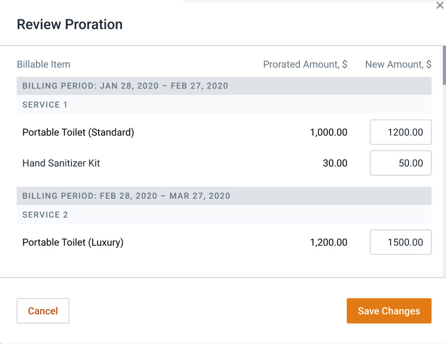

# Pricing Engine new Columns Description

[Back to Pricing Engine](./Pricing Engine.md)

- `subscription_orders_line_items`.

Columns Description:

```
    price = price for quantity=1
    overridden_price = overridden price for quantity=1
    amount = quantity * (overridden_price || price)
```

- `subscription_orders`.

Columns Description:

```
    price = price for quantity=1
    overridden_price = overridden price for quantity=1
    amount = quantity * (overridden_price || price)

    one_time_line_items_amount = SUM(subscription_orders_line_items.amount)

    total = amount + one_time_line_items_amount
```

- `subscription_recurring_line_items_schedule`.

UI (to understand):



Columns Description:

```
    price = price for quantity=1
    overridden_price = overridden price for quantity=1
    amount = quantity * (overridden_price || price)
    service_used_proportion = calculated based on service frequency, proration type, service days of week, price range period
    used_amount = service_used_proportion * amount
```

- `subscription_recurring_line_items_periods`.

UI (to understand):


Columns Description:

```
    start_at
    end_at
    invoiced_at
    paid_at
    billing_cycle
    proration_type
    frequency_id
    service_days_of_week

    price = last price from schedule for period for quantity=1
    overridden_price = last overridden price from schedule for period for quantity=1

    prorated_amount = SUM(subscription_recurring_line_items_schedule.used_amount)
    overridden_prorated_amount - overridden prorated_amount

    total = overridden_prorated_amount || prorated_amount
```

- `subscription_service_items_schedule`.

UI (to understand):


Columns Description:

```
    price = price for quantity=1
    overridden_price = overridden price for quantity=1
    amount = quantity * (overridden_price || price)
    service_used_proportion = calculated based on service frequency, proration type, service days of week, price range period
    used_amount = service_used_proportion * amount
```

- `subscription_service_items_periods`.

UI (to understand):


Columns Description:

```
    start_at
    end_at
    invoiced_at
    paid_at
    billing_cycle
    proration_type
    frequency_id
    service_days_of_week

    price = last price from schedule for period for quantity=1
    overridden_price = last overridden price from schedule for period for quantity=1

    prorated_amount = SUM(subscription_service_items_schedule.used_amount)
    overridden_prorated_amount - overridden prorated_amount

    recurring_total = (overridden_prorated_amount || prorated_amount || amount) + SUM(subscription_recurring_line_items_periods.total)
    one_time_total = SUM(subscription_orders.total)
    total = recurring_total + one_time_total
```

- `subscriptions_periods`.

Columns Description:

```
    recurring_prorated_amount = SUM(subscription_service_items_periods.prorated_amount) + SUM(subscription_recurring_line_items_periods.prorated_amount)
    recurring_overridden_prorated_amount = SUM(subscription_service_items_periods.overridden_prorated_amount) + SUM(subscription_recurring_line_items_periods.overridden_prorated_amount)
    recurring_total = SUM(subscription_service_items_periods.recurring_total)

    one_time_line_items_amount = SUM(subscription_orders.one_time_line_items_amount)
    one_time_services_amount = SUM(subscription_orders.amount)
    one_time_total = SUM(subscription_orders.total)

    total = recurring_total + one_time_total
    charges_total = total + surcharges
    grand_total = charges_total + taxes
```
