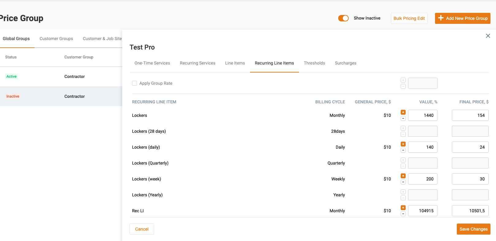

# Price Configuration DB Tables structure

`prices` table. It is a table that stores prices per each service/line item under price groups (Rack Rates).
It's a schedule of rates for services/line items under price group.

## UI (to understand)



## DB Structure

```sql
CREATE TABLE prices(
  id INTEGER NOT NULL GENERATED BY DEFAULT AS IDENTITY,

  price_group_id INTEGER NOT NULL,

  entity_type TEXT NOT NULL,

  billable_service_id INTEGER DEFAULT NULL,
  billable_line_item_id INTEGER DEFAULT NULL,
  equipment_item_id INTEGER DEFAULT NULL,
  material_id INTEGER DEFAULT NULL,
  threshold_id INTEGER DEFAULT NULL,
  surcharge_id INTEGER DEFAULT NULL,

  billing_cycle TEXT DEFAULT NULL,
  frequency_id INTEGER DEFAULT NULL,

  -- we never change the price: we create new record and
  -- set next_price and end_date for previous (closest by date) record
  price bigint NOT NULL, -- show as decimal depending on locale on FE, at least 6 fractional digits
  next_price bigint, -- show as decimal depending on locale on FE, at least 6 fractional digits
  limit numeric DEFAULT NULL, -- limit for threshold application

  -- we need this field cause we update ids on
  --    - linked one-time entities only for those who has service date starting from this date
  --    - linked recurring entities by cron on this date (but need to clarify
  start_at timestamp without time zone NOT NULL DEFAULT CURRENT_TIMESTAMP,
  end_at timestamp without time zone DEFAULT NULL,

  created_at timestamp without time zone DEFAULT CURRENT_TIMESTAMP,
  user_id TEXT NOT NULL,
  trace_id TEXT NOT NULL,

  PRIMARY KEY ("id"),
  FOREIGN KEY ("price_group_id") REFERENCES "price_groups"("id") MATCH SIMPLE
      ON update NO ACTION
      ON delete RESTRICT,

  CHECK (entity_type <@ (ARRAY['SURCHARGE'::TEXT, 'THRESHOLD'::TEXT, 'ONE_TIME_SERVICE'::TEXT, 'RECURRING_SERVICE'::TEXT, 'ONE_TIME_LINE_ITEM'::TEXT, 'RECURRING_LINE_ITEM'::TEXT])),
  CHECK(billing_cycle <@ (ARRAY['daily'::TEXT, 'weekly'::TEXT, 'monthly'::TEXT, '28days'::TEXT, 'quarterly'::TEXT, 'yearly'::TEXT]))
);
CREATE INDEX "prices_start_at" ON "prices" ("start_at" DESC);
CREATE INDEX "prices_end_at" ON "prices" ("end_at" ASC NULLS LAST);
```
