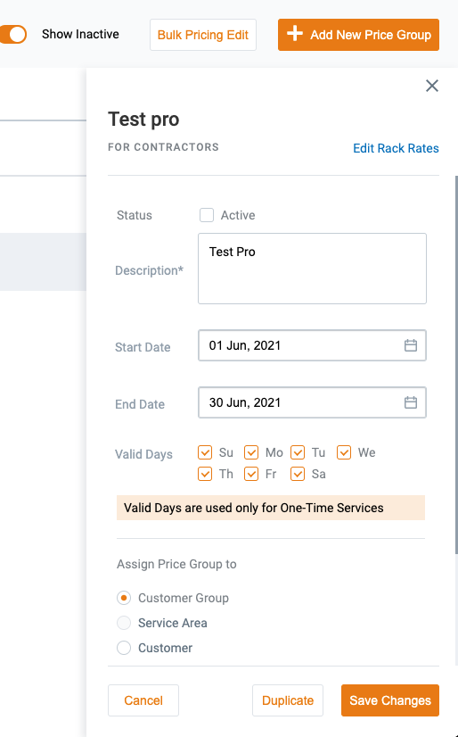

# Price Groups DB Tables structure

## `price_groups` table. It is a container for prices

### UI (to understand)



### DB Structure

```sql
CREATE TABLE price_groups(
  id INTEGER NOT NULL GENERATED BY DEFAULT AS IDENTITY,

  is_global BOOLEAN NOT NULL DEFAULT FALSE,
  description TEXT NOT NULL,

  business_unit_id INTEGER NOT NULL,
  business_line_id INTEGER NOT NULL,

  service_areas_ids INTEGER[] NOT NULL DEFAULT '{}',
  customer_group_id INTEGER DEFAULT NULL,
  customer_id INTEGER DEFAULT NULL,
  customer_job_site_id INTEGER DEFAULT NULL,

  active boolean NOT NULL DEFAULT true,
  valid_days INTEGER[] NOT NULL DEFAULT '{}',
  overweight_setting TEXT NOT NULL default 'global'::TEXT,
  usage_days_setting TEXT NOT NULL default 'global'::TEXT,
  demurrage_setting TEXT NOT NULL default 'global'::TEXT,
  dump_setting TEXT NOT NULL default 'material'::TEXT,
  load_setting TEXT NOT NULL default 'material'::TEXT,

  -- this is dates range for price group container,
  -- it activates/deactivates all linked prices,
  -- but we need to clarify what to do with
  -- entities linked to prices that are linked to price groups aren't active anymore
  start_at timestamp without time zone NOT NULL DEFAULT CURRENT_TIMESTAMP,
  end_at timestamp without time zone DEFAULT NULL,

  PRIMARY KEY ("id"),
  FOREIGN KEY ("business_unit_id") REFERENCES "business_units"("id") MATCH SIMPLE
      ON update NO ACTION
      ON delete RESTRICT,
  FOREIGN KEY ("business_line_id") REFERENCES "business_lines"("id") MATCH SIMPLE
      ON update NO ACTION
      ON delete RESTRICT,
  CHECK (overweight_setting = ANY (ARRAY['global'::TEXT, 'canSize'::TEXT, 'material'::TEXT, 'canSizeAndMaterial'::TEXT])),
  CHECK (usage_days_setting = ANY (ARRAY['global'::TEXT, 'canSize'::TEXT, 'material'::TEXT, 'canSizeAndMaterial'::TEXT])),
  CHECK (demurrage_setting = ANY (ARRAY['global'::TEXT, 'canSize'::TEXT, 'material'::TEXT, 'canSizeAndMaterial'::TEXT]))
);
CREATE INDEX "price_groups_start_at" ON "price_groups" ("start_at" DESC);
CREATE INDEX "price_groups_end_at" ON "price_groups" ("end_at" ASC NULLS LAST);
```

## `price_groups_historical` table. It is a log of states of Price Groups (new record with actual snapshot at each create/update operation)

DB Structure

```sql
  -- this table will be used to show to which price group was linked an entity (through price)
  -- at the moment of creation/update
  -- and will show appropriate price group description and linked group entities for the moment
  -- of entity creation/update
CREATE TABLE price_groups_historical(
  id INTEGER NOT NULL GENERATED BY DEFAULT AS IDENTITY,

  is_global BOOLEAN DEFAULT FALSE,
  description TEXT DEFAULT NULL,

  business_unit_id INTEGER DEFAULT NULL,
  business_line_id INTEGER DEFAULT NULL,

  service_areas_ids INTEGER[] DEFAULT NULL,
  customer_group_id INTEGER DEFAULT NULL,
  customer_id INTEGER DEFAULT NULL,
  customer_job_site_id INTEGER DEFAULT NULL,

  active boolean DEFAULT NULL,
  valid_days INTEGER[] DEFAULT NULL,
  overweight_setting TEXT DEFAULT NULL,
  usage_days_setting TEXT DEFAULT NULL,
  demurrage_setting TEXT DEFAULT NULL,
  dump_setting TEXT NOT NULL DEFAULT NULL,
  load_setting TEXT NOT NULL DEFAULT NULL,

  start_at timestamp without time zone DEFAULT NULL,
  end_at timestamp without time zone DEFAULT NULL,

  original_id INTEGER NOT NULL,
  event_type TEXT NOT NULL,
  user_id TEXT NOT NULL,
  created_at timestamp without time zone DEFAULT CURRENT_TIMESTAMP,
  updated_at timestamp without time zone DEFAULT CURRENT_TIMESTAMP,
  trace_id TEXT NOT NULL,

  PRIMARY KEY ("id"),
  FOREIGN KEY ("original_id") REFERENCES "price_groups"("id") MATCH SIMPLE
      ON update NO ACTION
      ON delete RESTRICT,

  CHECK (event_type = ANY (ARRAY['created'::TEXT, 'edited'::TEXT, 'deleted'::TEXT]))
);
```
