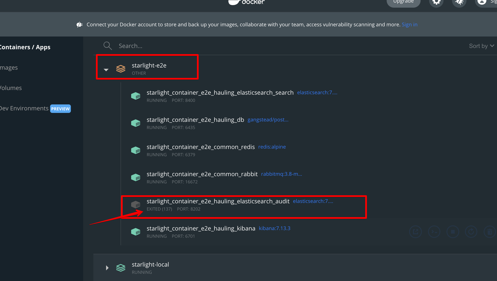

# Instructions to run Hauling Backend e2e (API) tests locally

## Requirements

[Provisioning Instructions](./provisioning.md)

## Getting started

1. Make sure that you have the following ENV variables set to these values:

- `NODE_ENV="test"`
- `ENV="e2e"`

## Usage

Open 2 (two) terminal windows (or tabs) in the same directory and run:

- `yarn start` (or `yarn start:dev`) in the first terminal window (or tab)
- `yarn test` in the second terminal window (or tab)

## Faq

1. If many tests fails:

- make sure all docker containers of the project are healthy:

  

  Sometimes you'll need to add more resources or stop other containers

2. Cannot connect to DB:

- make sure you're using correct `.env` file, commands:
- `cat ./.env | grep _CONTAINER` show all docker containers names from `.env`
- `cat ./.env | grep DB_` show all DB configs from `.env`

  will help you

3. Having troubles with docker:

- again, make sure you're using correct `.env` file, commands:
- `yarn docker:e2e:list` list all containers related to hauling local env
- `yarn docker:e2e:stop` stop all containers related to hauling local env
- `yarn docker:e2e:prune` remove all stopped containers and volumes related to hauling local env
- `yarn docker:stop` stop all containers
- `yarn docker:clean` remove all stopped containers and volumes
- `yarn docker:prune` remove all stopped containers, images, volumes, networks

  will help you

4. If some tests randomly fails:

- tweak these vars in your `.env` file:

```
E2E_HEAVY_API_CALL_TIMOUT_SMALL=2000
E2E_HEAVY_API_CALL_TIMOUT_MEDIUM=5000
E2E_HEAVY_API_CALL_TIMOUT_LARGE=10000
```

in most cases increasing them will help you.

This is caused by the architecture of our API handlers - they run a lot of nested processing tasks after sending response.

And on low-performance hardware (or not plugged-in into the socket) you can face race conditions caused by that.
