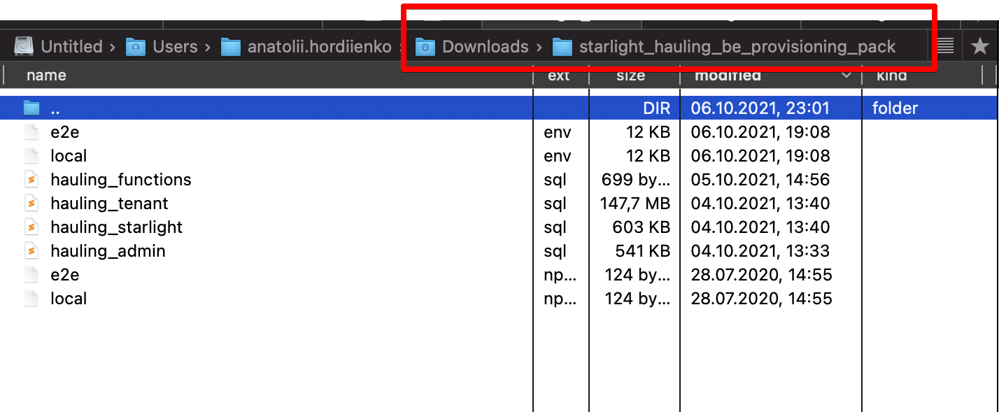

# Hauling Backend via Docker

## Requirements

You need to make sure the following are installed:

- [`Node 14.17.1`](https://nodejs.org/en/) or newer (prefer to use `nvm` to manage versions of nodejs)
- [`Postgres 12`](https://www.postgresql.org/) or follow this instruction: [Setup psql from docker](./psql.md)
- [`yarn` classic](https://classic.yarnpkg.com/en/docs/install) (not yarn 2.x, simply run `npm i -g yarn` when you have appropriate version of nodejs installed and activated)
- [Docker Engine CE](https://docs.docker.com/engine/install/#server) 19.03 or newer
- [Docker Compose](https://docs.docker.com/compose/install/) 1.22 or newer

## Getting started

### 1. Get Provisioning pack

1.1. Contact Anatolii Hordiienko and get from `starlight_hauling_be_provisioning_pack.zip` it from in .zip

1.2. Unzip it to you ~/Downloads folder and make sure that the structure looks like this:



and you have all files like on this picture:

- `e2e.env`
- `local.env`
- `e2e.npmrc`
- `local.npmrc`
- `hauling_admin.sql`
- `hauling_starlight.sql`
- `hauling_tenant.sql`
- `hauling_functions.sql`

  1.3. Edit `e2e.env` and `local.env` files and make sure that you have uncommented one proper DB image depending on your platform:

```
# uncomment this if you're working on x86 platform
DB_IMAGE="postgis/postgis:13-3.1-alpine"
# uncomment this if you're working on arm platform
#DB_IMAGE="gangstead/postgis:13-3.1-arm"
```

### 2. Actualize project folder

2.1. Make sure that your local project folder has the latest version of configs from `development` branch

2.2. Update dependencies by running this commands in your terminal (in project directory):

- `yarn`

### 3. Run provisioning

> **Note**
>
> You can choose 2 different configurations to provision: `e2e` and `local`
>
> Choose and `e2e` when you're going to run `e2e` tests and `local` if you're going to simply proceed with development

3.1. To run provisioning for `e2e` setup run this in your terminal:

- `yarn provision:e2e`

  3.2. To run provisioning for `local` setup run this in your terminal:

- `yarn provision:local`

> 3.3. **Windows Issues**
>
> Windows platform has known issues running psql commands from pre-defined scripts
> To make DB dump restore from dump work on your Windows you'll have to run these commands manually:

        3.3.1. On Windows make sure that your postgres `bin` folder is in your `$PATH` variable

        3.3.2. To complete provisioning on Windows for `e2e` setup manually run this in your PowerShell:

        ```
        export PGPASSWORD='starlight_hauling_e2e'; psql.exe -h localhost -d starlight_hauling_e2e -U starlight_hauling_e2e -p 6435 -c 'DROP schema IF EXISTS stark CASCADE;'
        export PGPASSWORD='starlight_hauling_e2e'; psql.exe -h localhost -d starlight_hauling_e2e -U starlight_hauling_e2e -p 6435 -c 'DROP schema IF EXISTS starlight CASCADE;'
        export PGPASSWORD='starlight_hauling_e2e'; psql.exe -h localhost -d starlight_hauling_e2e -U starlight_hauling_e2e -p 6435 -c 'DROP schema IF EXISTS admin CASCADE;'

        export PGPASSWORD='starlight_hauling_e2e'; psql.exe -h localhost -d starlight_hauling_e2e -U starlight_hauling_e2e -p 6435 -f ~/Downloads/starlight_hauling_be_provisioning_pack/hauling_admin.sql
        export PGPASSWORD='starlight_hauling_e2e'; psql.exe -h localhost -d starlight_hauling_e2e -U starlight_hauling_e2e -p 6435 -f ~/Downloads/starlight_hauling_be_provisioning_pack/hauling_starlight.sql
        export PGPASSWORD='starlight_hauling_e2e'; psql.exe -h localhost -d starlight_hauling_e2e -U starlight_hauling_e2e -p 6435 -f ~/Downloads/starlight_hauling_be_provisioning_pack/hauling_tenant.sql

        export PGPASSWORD='starlight_hauling_e2e'; psql.exe -h localhost -d starlight_hauling_e2e -U starlight_hauling_e2e -p 6435 -c "DELETE FROM admin.companies WHERE tenant_id NOT IN (1, 2);"
        export PGPASSWORD='starlight_hauling_e2e'; psql.exe -h localhost -d starlight_hauling_e2e -U starlight_hauling_e2e -p 6435 -c "DELETE FROM admin.company_mail_settings WHERE tenant_id NOT IN (1, 2);"
        export PGPASSWORD='starlight_hauling_e2e'; psql.exe -h localhost -d starlight_hauling_e2e -U starlight_hauling_e2e -p 6435 -c "DELETE FROM admin.tenants WHERE name NOT IN ('stark', 'starlight');"
        export PGPASSWORD='starlight_hauling_e2e'; psql.exe -h localhost -d starlight_hauling_e2e -U starlight_hauling_e2e -p 6435 -c "DELETE FROM admin.tenant_migrations WHERE tenant NOT IN ('stark', 'starlight');"

        # load aggregate functions that wasn't restored loaded from dump
        export PGPASSWORD='starlight_hauling_e2e'; psql.exe -h localhost -d starlight_hauling_e2e -U starlight_hauling_e2e -p 6435 -f ~/Downloads/starlight_hauling_be_provisioning_pack/hauling_functions.sql
        ```

        3.3.3. To complete provisioning on Windows for `local` setup manually run this in your PowerShell:

        ```
        export PGPASSWORD='starlight_hauling_local'; psql.exe -h localhost -d starlight_hauling_local -U starlight_hauling_local -p 7435 -c 'DROP schema IF EXISTS stark CASCADE;'
        export PGPASSWORD='starlight_hauling_local'; psql.exe -h localhost -d starlight_hauling_local -U starlight_hauling_local -p 7435 -c 'DROP schema IF EXISTS starlight CASCADE;'
        export PGPASSWORD='starlight_hauling_local'; psql.exe -h localhost -d starlight_hauling_local -U starlight_hauling_local -p 7435 -c 'DROP schema IF EXISTS admin CASCADE;'

        export PGPASSWORD='starlight_hauling_local'; psql.exe -h localhost -d starlight_hauling_local -U starlight_hauling_local -p 7435 -f ~/Downloads/starlight_hauling_be_provisioning_pack/hauling_admin.sql
        export PGPASSWORD='starlight_hauling_local'; psql.exe -h localhost -d starlight_hauling_local -U starlight_hauling_local -p 7435 -f ~/Downloads/starlight_hauling_be_provisioning_pack/hauling_starlight.sql
        export PGPASSWORD='starlight_hauling_local'; psql.exe -h localhost -d starlight_hauling_local -U starlight_hauling_local -p 7435 -f ~/Downloads/starlight_hauling_be_provisioning_pack/hauling_tenant.sql

        export PGPASSWORD='starlight_hauling_local'; psql.exe -h localhost -d starlight_hauling_local -U starlight_hauling_local -p 7435 -c "DELETE FROM admin.companies WHERE tenant_id NOT IN (1, 2);"
        export PGPASSWORD='starlight_hauling_local'; psql.exe -h localhost -d starlight_hauling_local -U starlight_hauling_local -p 7435 -c "DELETE FROM admin.company_mail_settings WHERE tenant_id NOT IN (1, 2);"
        export PGPASSWORD='starlight_hauling_local'; psql.exe -h localhost -d starlight_hauling_local -U starlight_hauling_local -p 7435 -c "DELETE FROM admin.tenants WHERE name NOT IN ('stark', 'starlight');"
        export PGPASSWORD='starlight_hauling_local'; psql.exe -h localhost -d starlight_hauling_local -U starlight_hauling_local -p 7435 -c "DELETE FROM admin.tenant_migrations WHERE tenant NOT IN ('stark', 'starlight');"

        export PGPASSWORD='starlight_hauling_local'; psql.exe -h localhost -d starlight_hauling_local -U starlight_hauling_local -p 7435 -f ~/Downloads/starlight_hauling_be_provisioning_pack/hauling_functions.sql
        ```

## Usage

- [Usage for E2E testing](./e2e.md)
- [Usage for local development](./local.md)
