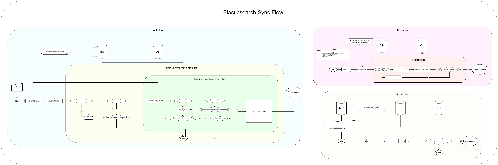

# Elasticsearch setup

This document describes our Elasticsearch setup and patterns. Bear in mind that
we treat indexing and [index management](#index-management) and [querying](#querying) as separate concerns,
and they are set up differently.

## Index management

### Index naming

Index names follow the pattern `{name}__{scope}__{timestamp}` where:  
`name` is a sequence of lowercase alphanumeric
characters optionally separated by underscores.  
`scope` represents the namespace this index is a part of. It is normally used to namespace subscriber-related data.
However, for instance, in administrative units index, it is used to scope data by country.
`timestamp` should match date format `yyyyMMddHHmmss`.

### Alias naming

When working with data we don't actually use index name - we use alias name instead.

Alias names follow the pattern `{name}__{scope}` where:  
`name` is a sequence of lowercase alphanumeric
characters optionally separated by underscores.  
`scope` represents the namespace this index is a part of. It is normally used to namespace subscriber-related data.
However, for instance, in administrative units index, it is used to scope data by country.

So it's the same like index name but without `timestamp` part

> **Note**
>
> To read more about our general approach to multi-tenancy, check [the relevant docs](../../docs/multi-tenancy.md).

### Index templates

We use index templates to simplify index set up and configuration. Index templates are stored in `indices` folder
and are simple JSON files with four top-level properties:

- `name` - this is not very important for indices, but should match the name of the index (i.e. `name` part above)
- `syncAllowed` - `boolean` describes itself and is used in index synchronization flow
- `level` - can be `root` or `tenant` and is used in index synchronization flow
- `content` - the configuration itself as a JSON object that will be sent to Elasticsearch

`content` _must_ include `index_patterns` key, which must be an array of index **versioned** wildcards.

The main benefit of this approach is that we need only set up index configuration once in Elasticsearch
and have it automatically applied to all our indices, thus reducing the risk of incompatible configurations.
Index templates are refreshed in Elasticsearch on each app start
(only if their version has changed or not available in Elasticsearch).

> **Important**
>
> Bear in mind, index templates only apply to _**newly**_ created indices. If you change the configuration,
> the changes will not propagate to indices that already exist, potentially breaking the app.
> To update the configuration without losing all the data, you need to increment the version of the template
> and migrate index data.

### Index aliasing

To simplify working with indices, we normally access them without the version, using only the alias.
Aliases to indices follow the same pattern as above with the exception that they have no `timestamp` part (i.e. `{name}__{scope}`).
This has two benefits:

1. We no longer need to track and mention the current index version all over the place.
2. It is easier to migrate between versions.

The migration process conceptually consists of the following steps:

1. Update the template.
2. Increment the version of template.
3. Restart the app.

Aliases provide for an efficient and painless migration scheme and clear separation from querying concerns.

## Data Sync flow

## Querying

For querying we again use Elasticsearch scripts.

### Query templates

Query templates are very similar to index templates with the difference that version does not apply to them.
Query templates are stored under `searchTemplates/` and are simple JSON files with two top-level properties:

- `name` - unlike index templates, this property is used to actually identify the template, so it is important that it has a unique value
- `content` - the actual search query as JSON object that is a valid Elasticsearch Query DSL query

In `content` object, double braces-delimited strings (like so, `{{size}}`) are replaced with params passed at query time.
In fact, it does not have to be an object, any valid Mustache template in string form can be used as long as it produces a valid
Elasticsearch query.

### Running queries

To run queries, we use Elasticsearch search template and multi-search template APIs. All templates should support
at least `query` and `size` parameters.

Using Mustache templates allows us to stay simple when we don't need to make anything complicated and use the full Mustache engine
managed by Elasticsearch without worrying how it actually does its job.
